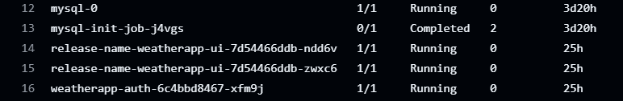
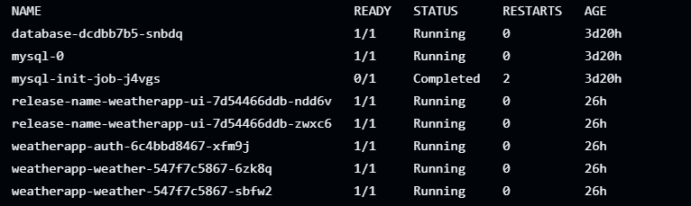

📌 Project Overview
This project is a Task Management Application that allows users to authenticate, create accounts, and track task statuses through a RESTful API.
The application is fully containerized and deployed using DevOps best practices on AWS EKS with a complete CI/CD pipeline.
=====================================================================================================================================================
🧩 Application Features
User authentication & signup
Task creation and status tracking
REST API to fetch task status
Secure database integration
Fully automated deployment pipeline
======================================================================================================================================================
🛠️ Tech Stack
🔹 Backend & Application
RESTful API
Database for authentication & user data
======================================================================================================================================================
🔹 DevOps & Infrastructure
Docker – Containerizing the application
Kubernetes (EKS) – Container orchestration
Helm – Kubernetes package management
Sealed Secrets – Secure secret encryption (instead of plain base64)
GitHub Actions – CI/CD pipeline automation
AWS – Cloud infrastructure (EKS Cluster)
======================================================================================================================================================
🔐 Security Implementation
Kubernetes Secrets are encrypted using Sealed Secrets
Prevents exposing sensitive data in Git repositories
Secrets are safely decrypted only inside the Kubernetes cluster
======================================================================================================================================================
🔄 CI/CD Pipeline
The project uses GitHub Actions to automate:
Code checkout
Docker image build
Image push to container registry
Helm chart update
Automatic deployment to AWS EKS via Kubernetes
======================================================================================================================================================
☁️ Cloud Infrastructure
AWS EKS for Kubernetes cluster
Managed Kubernetes nodes
Secure networking and IAM integration
======================================================================================================================================================
📦 Deployment Flow
Copy code
Text
Developer → GitHub Repo
        → GitHub Actions (CI/CD)
        → Docker Build & Push
        → Helm Deployment
        → AWS EKS Cluster
        → Running Application
======================================================================================================================================================
🚀 Why This Project?
This project demonstrates:
Real-world DevOps workflow
Secure Kubernetes deployments
CI/CD automation
Cloud-native application deployment
Best practices for production-ready systems
======================================================================================================================================================
🧠 Skills Demonstrated
DevOps Engineering
Kubernetes & Helm
AWS EKS
CI/CD Pipelines
Secure Secret Management
Containerization
======================================================================================================================================================
All Project Steps

======================================================================================================================================================
📝 Architecture Note
This project uses a StatefulSet with a PersistentVolumeClaim (PVC) to ensure data persistence for the database running inside the Kubernetes cluster.
The PVC is bound to a Persistent Volume, which is used to store the database data outside the container. This guarantees that the data is not lost if the pod restarts or is rescheduled to another node in the cluster.
The database container is responsible for handling application requests. When a user accesses the application and performs authentication, new data is written and stored persistently through the attached volume.
Additionally, an Init Job is used to prepare the database environment. This job runs with a dedicated Service Account, which has the required permissions to:
Initialize the database
Create the required database user
Apply initial database configurations or schemas
The Service Account ensures that database operations are executed securely and with limited permissions, following Kubernetes security best practices.
Once the initialization is completed, the StatefulSet database pods can safely use the prepared database setup.

======================================================================================================================================================
This application consists of a set of web services that are responsible for user registration and authentication.
Users can access these websites and register new accounts. During the registration process, the services send the user data to a backend container, where the data is stored securely in the database.
When a user performs a login, the application communicates with the backend services to retrieve the stored user information. The system then validates the credentials and returns the related user data associated with that account.
All user-related operations, including registration and login, are handled through the services, which act as an interface between the users and the database container.
This design ensures:
Secure user authentication
Proper data handling and storage
Clear separation between the web services and the database layer

======================================================================================================================================================
🌦️ Weather Service
📌 Overview
Weather Service is a service responsible for retrieving weather conditions from an external Weather API.
The service receives the required input data, sends a request to the API, and returns the weather information to the main application.
🎯 Purpose
The main goals of this service are:
Fetch current weather data from an external API
Isolate weather-related logic into a dedicated service
Make the weather functionality reusable and easy to maintain
🔧 How It Works
The application sends a request to the Weather Service
The service receives the required parameters (such as location details)
The service sends a request to the external Weather API
The API responds with weather data
The service processes and returns the response to the application
🔗 External API
The service depends on an external Weather API
All required parameters are passed from the application to the service
The service does not store data; it only fetches and returns it
📥 Input
The service may accept the following inputs:
Location (City name or Latitude & Longitude)
API Key (if required)
Units (Metric / Imperial)
📤 Output
The service returns structured weather data, such as:
Temperature
Weather condition (Sunny, Cloudy, Rainy, etc.)
Humidity
Wind speed
🧱 Responsibility
Handle communication with the Weather API
Validate request parameters
Return clean and formatted weather data to the application
🚀 Usage
This service is designed to be used as a core component within the application wherever weather information is required.

