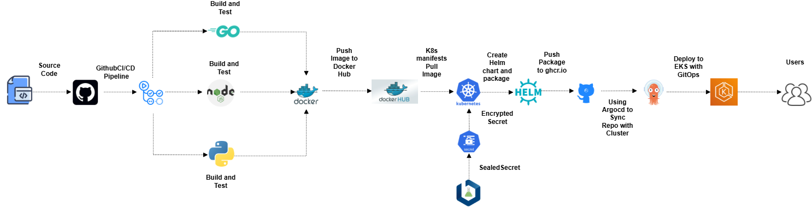
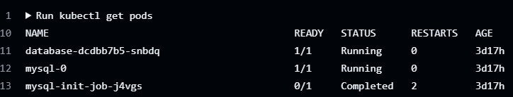

📌 Project Overview
This project is a Task Management Application that allows users to authenticate, create accounts, and track task statuses through a RESTful API.
The application is fully containerized and deployed using DevOps best practices on AWS EKS with a complete CI/CD pipeline.
=====================================================================================================================================================
🧩 Application Features
User authentication & signup
Task creation and status tracking
REST API to fetch task status
Secure database integration
Fully automated deployment pipeline
======================================================================================================================================================
🛠️ Tech Stack
🔹 Backend & Application
RESTful API
Database for authentication & user data
======================================================================================================================================================
🔹 DevOps & Infrastructure
Docker – Containerizing the application
Kubernetes (EKS) – Container orchestration
Helm – Kubernetes package management
Sealed Secrets – Secure secret encryption (instead of plain base64)
GitHub Actions – CI/CD pipeline automation
AWS – Cloud infrastructure (EKS Cluster)
======================================================================================================================================================
🔐 Security Implementation
Kubernetes Secrets are encrypted using Sealed Secrets
Prevents exposing sensitive data in Git repositories
Secrets are safely decrypted only inside the Kubernetes cluster
======================================================================================================================================================
🔄 CI/CD Pipeline
The project uses GitHub Actions to automate:
Code checkout
Docker image build
Image push to container registry
Helm chart update
Automatic deployment to AWS EKS via Kubernetes
======================================================================================================================================================
☁️ Cloud Infrastructure
AWS EKS for Kubernetes cluster
Managed Kubernetes nodes
Secure networking and IAM integration
======================================================================================================================================================
📦 Deployment Flow
Copy code
Text
Developer → GitHub Repo
        → GitHub Actions (CI/CD)
        → Docker Build & Push
        → Helm Deployment
        → AWS EKS Cluster
        → Running Application
======================================================================================================================================================
🚀 Why This Project?
This project demonstrates:
Real-world DevOps workflow
Secure Kubernetes deployments
CI/CD automation
Cloud-native application deployment
Best practices for production-ready systems
======================================================================================================================================================
🧠 Skills Demonstrated
DevOps Engineering
Kubernetes & Helm
AWS EKS
CI/CD Pipelines
Secure Secret Management
Containerization
======================================================================================================================================================
All Project Steps

======================================================================================================================================================
📝 Architecture Note
This project uses a StatefulSet with a PersistentVolumeClaim (PVC) to ensure data persistence for the database running inside the Kubernetes cluster.
The PVC is bound to a Persistent Volume, which is used to store the database data outside the container. This guarantees that the data is not lost if the pod restarts or is rescheduled to another node in the cluster.
The database container is responsible for handling application requests. When a user accesses the application and performs authentication, new data is written and stored persistently through the attached volume.
Additionally, an Init Job is used to prepare the database environment. This job runs with a dedicated Service Account, which has the required permissions to:
Initialize the database
Create the required database user
Apply initial database configurations or schemas
The Service Account ensures that database operations are executed securely and with limited permissions, following Kubernetes security best practices.
Once the initialization is completed, the StatefulSet database pods can safely use the prepared database setup.

======================================================================================================================================================

